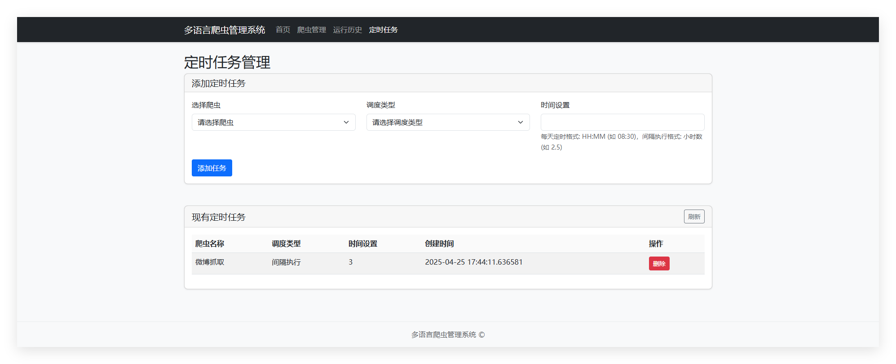
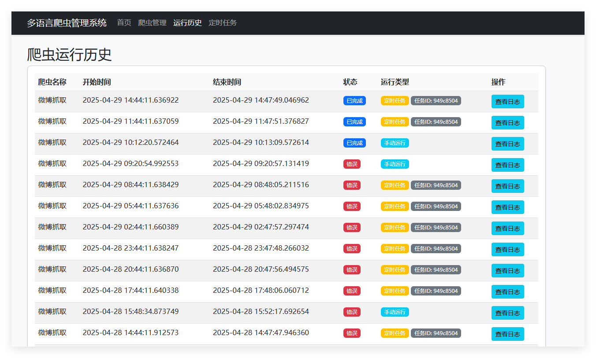

# 多语言爬虫管理系统

这是一个简单易用的爬虫管理平台，支持多种语言的爬虫脚本管理、运行状态监控和日志查看。

## 功能特点

- **Web界面管理爬虫**：通过Web界面启动爬虫，查看爬虫状态
- **爬虫信息管理**：每个爬虫都有一个config.json文件，记录爬虫的基本信息
- **爬虫状态显示**：实时查看哪些爬虫正在运行，支持手动刷新或自动刷新
- **日志管理**：按日期存储爬虫日志，支持在前端动态查看
- **定时任务管理**：设置爬虫的定时运行计划
- **数据库记录**：使用SQLite数据库存储爬虫运行信息

## 系统结构

- `app.py`：主应用程序入口
- `crawler_manager.py`：爬虫管理器，负责爬虫的运行和状态管理
- `database/`：数据库模型和操作
- `crawlers/`：存放爬虫脚本
- `logs/`：存放爬虫运行日志
- `web/`：Web前端文件

## 爬虫目录结构

每个爬虫应该是`crawlers`目录下的一个子目录，包含以下文件：

- `main.py`：爬虫主程序
- `config.json`：爬虫配置信息

## 日志目录结构

日志按照以下格式存储：`logs/年份/月份/年-月-日 时-分_爬虫名称.log`

## 使用方法

1. 安装依赖：
```
pip install flask apscheduler
```

2. 运行系统：
```
python app.py
```

3. 访问Web界面：
```
http://localhost:5000
```

## 添加新爬虫

1. 在`crawlers`目录下创建新的子目录
2. 在子目录中创建`main.py`和`config.json`文件
3. 在`config.json`中配置爬虫信息
4. 重启系统或刷新页面即可看到新添加的爬虫

## 图片





## 支持的爬虫语言

系统支持任何可以通过命令行运行的脚本语言，包括但不限于：

- Python
- JavaScript (Node.js)
- Java
- Go
- Ruby
- PHP

只需确保相应的运行环境已安装，并且爬虫目录中包含正确的入口文件（main.py或其他）。
